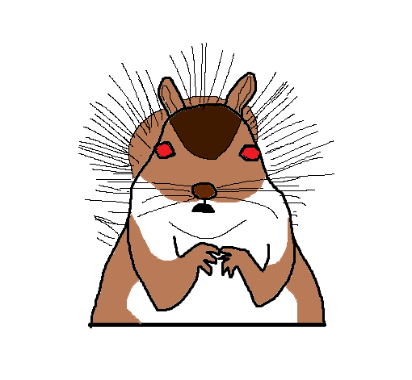

# Angry Squirrels

  

> 2042\. L'explosion de la consommation a provoqué la chute de l'Humanité. Les seuls êtres vivants restants sont une race d'écureuils mutants, et quelques humains qui essayent tant bien que mal de survivre. Armé de votre meilleure batte de baseball, vous vous battez pour essayer de rendre à l'Humanité sa gloire passée...

 

## Introduction

"Angry Squirrels" est une **preuve de concept** de RPG textuel, utilisant uniquement l'outil de discussion Discord. L'objectif du projet est de construire itérativement une application complexe, d'une manière compréhensible par un néophite.

 

## Technologies

"Angry Squirrels" sera basé sur les technologies suivantes :

 - Node.js `12.19.0 LTS`
 - TypeScript `4.0.3`
 - discord.js `12.4.1`

 

## Cahier des charges

L'objectif de ce projet est de créer un bot Discord. Chaque version ajoutera des fonctionnalitées plus ou moins importantes.

Le préfixe utilisé par le bot discord sera `!!`.

 

### `v1` - Rabid Beast

La version 1 (`v1`) de "Angry Squirrels" sera une simple prise en main, et répondra uniquement aux besoins suivants :

Version | Besoin
:-----: | :-----
 `v1`   | Un utilisateur pourra lire le lore (`!!lore`).
 `v1`   | Un utilisateur pourra afficher les informations du bot (`!!help`).
 `v1`   | Un monstre pourra apparaître aléatoirement, le premier joueur à attaquer tuera automatiquement le monstre (`!!attack`).

 

## Contribution

Ce projet suit la spécification de [Conventional Commits](https://www.conventionalcommits.org/fr/v1.0.0/).
